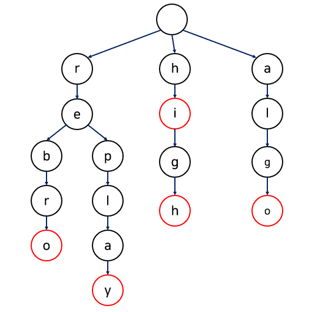

# 트라이 (Trie)

- 문자열에서 검색을 빠르게 도와주는 자료구조
- 이진 탐색 트리의 시간복잡도는 O(logN)이지만,
  이를 문자열에 적용하면 O(MlogN)이다. (M = 문자열의 최대 길이)
- 반면, 트라이 알고리즘의 시간복잡도 `O(M)`



트리 노드로 구성되어 있으며, 각 노드마다 Key-Value 맵을 가지고 있음

- Key : 알파벳
- Value : 키 값에 해당하는 자식 노드

각 문자열의 끝은 종료 노드 혹은 플래그로 표시됨

```java
class TrieNode{
		Map<Character, TrieNode> children;

		public TrieNode(){
				children = new HashMap<>();
		}
}
```

## 장단점

**장점**

효율적인 검색 : 시간복잡도가 데이터의 수에 비례하지 않음; **최대 단어 길이**에만 비례

자동 완성 (검색어 제안) 기능 구현에 적합

**단점**

메모리 추가 사용 : 각 노드가 자식 노드의 포인터를 가짐

구현의 복잡함

## 구현

### 검색

> 검색 문자열을 순회하면서 해당 알파벳 키를 가진 자식이 있는지 확인한다.

```java
public TrieNode search(String word){
		TrieNode cur = root; // root에서부터 탐색 시작

		for (int i=0; i<word.length(); i++){
				char c = word.charAt(i);

				if (cur.children.containsKey(c)){
						cur = cur.children.get(c);
				}
				else return null; // word가 Trie에 존재하지 않음
		}

		return cur;
}
```

### 삽입

> 삽입 문자열을 순회하면서 해당 알파벳 키를 가진 자식이 있는지 확인하고,
> 자식이 없다면 그 끝에 추가한다.

```java
public void insert(String word){
		TrieNode cur = root; // root에서부터 시작

		for (int i=0; i<word.length(); i++){
				char c = word.charAt(i);

				if (cur.children.containsKey(c)){
						cur = cur.children.get(c);
				}
				else{
						// 자식이 없으므로 노드 생성해 추가
						TrieNode newNode = new TrieNode();
						cur.children.put(c, newNode);
						cur = newNode;
				}
		}

		cur.children.put('*', null); // end 표시
}
```

## 연습 문제

[https://www.acmicpc.net/problem/5052](https://www.acmicpc.net/problem/5052)

- 설명

  > 한 번호가 다른 번호의 접두어인 경우가 없는 목록인가?

  - 테스트 케이스 t (50)
  - 전화번호 수 n (10000)
  - 전화번호의 길이 최대 10자리

  ```java
  // 입력
  2
  3
  911
  97625999
  91125426
  5
  113
  12340
  123440
  12345
  98346

  // 출력
  NO
  YES
  ```

- 풀이

  ```java
  static class Trie {
      boolean end;
      boolean pass;
      Trie[] child; // Map으로 구성해도 됨

      Trie() {
          end = false;
          pass = false;
          child = new Trie[10];
      }

      public boolean insert(String str, int idx) {

          //끝나는 단어 있으면 false 종료
          if(end) return false;

          //idx가 str만큼 왔을때
          if(idx == str.length()) {
              end = true;
              if(pass) return false; // 더 지나가는 단어 있으면 false 종료
              else return true;
          }
          //아직 안왔을 때
          else {
              int next = str.charAt(idx) - '0';
              if(child[next] == null) {
                  child[next] = new Trie();
                  pass = true;
              }
              return child[next].insert(str, idx+1);
          }

      }
  }
  ```
