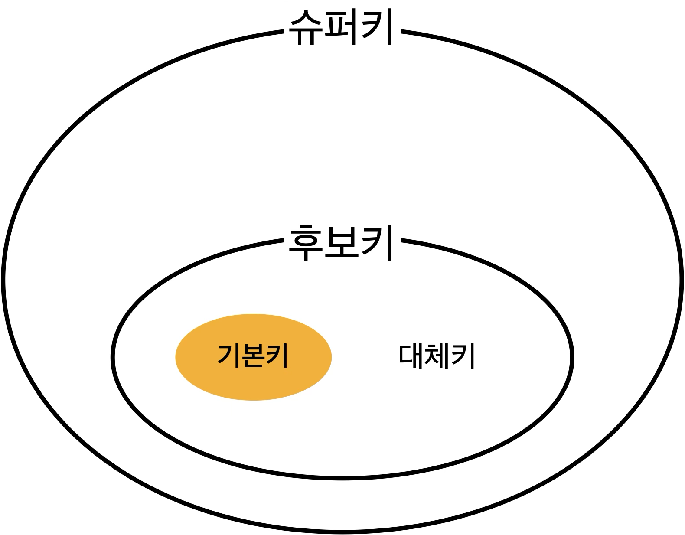

# 키 (Key)

> DB에서 검색이나 정렬 시에 Tuple을 구분할 수 있는 기준이 되는 속성

## 키의 종류

### 슈퍼키

> 유일성은 만족하지만, 최소성은 만족하지 못하는 키

### 후보키

> Tuple을 유일하게 식별하기 위해 사용하는 속성(키)들의 집합

기본키가 될 수 있음

**유일성**(튜플을 유일하게 식별)과 **최소성**(필요한 속성으로만 구성)을 만족한다.

### 기본키

> 후보키 중 선택한 하나의 속성

**개체무결성**을 만족한다. (NULL값을 가지지 않고, 중복값을 가지지 않음)

**유일성**과 **최소성**을 만족한다.

자연키와 인조키(대리키) 중 하나를 선택해 설정

**자연키**

- 중복되지 않는 것을 자연스럽게 뽑은 키
- 언젠가 변할 수 있음
- User 테이블의 주민등록번호, 전화번호 등

**인조키(대리키)**

- 키 역할을 위해 인위적으로 만든 키
- 변하지 않음
- UUID, Auto Increment 등

### 대체키(보조키)

> 후보키 중 기본키를 제외한 나머지 키

### 외래키

> 다른 릴레이션의 기본키를 그대로 참조하는 속성의 집합

참조 무결성을 만족해야 함

 

---

# Q&A

 Key란 무엇이고, 종류는 무엇이 있나요? 

 

- Key = 튜플을 구분할 수 있는 기준이 되는 속성

1. 후보키
2. 기본키
3. 대체키
4. 슈퍼키
5. 외래키

